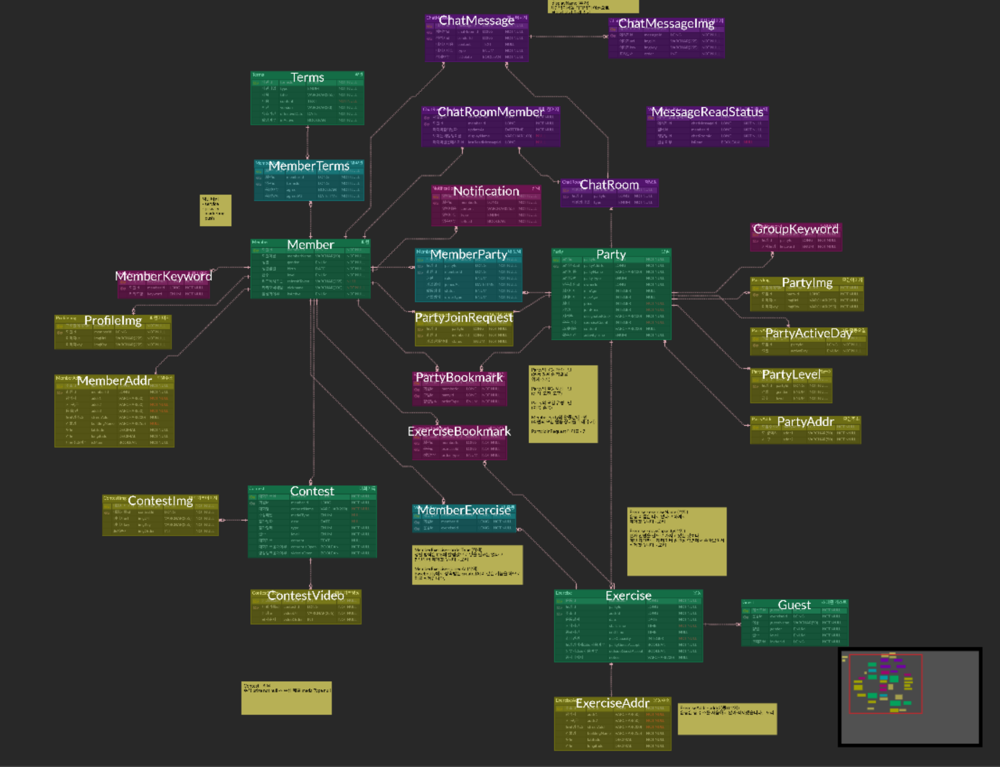

# 🏸 콕플: 배드민턴을 위한 가장 스마트한 모임 플랫폼!


콕플은 지역, 급수, 일정 등 조건에 맞는 배드민턴 모임을 쉽고 간편하게 찾고 참여 및 모임 운영할 수 있는 전용 플랫폼입니다.

<br>
<br>

## 💻 <strong>Cockple Backend Team

<br>

|  |  |  |  |
|:---:|:---:|:---:|:---:|
| [강하나](https://github.com/kanghana1) | [김재림](https://github.com/ri-mmu) | [권유민](https://github.com/dbalsk) | [조세훈](https://github.com/Dimo-2562) |
| Backend<br>Leader<br>DevOps | Backend<br><br> | Backend<br><br> | Backend<br><br> |


<br>
<br>


<br>
<br>

## 🏗️ Architecture


<br>
<br>
<br>
<br>


## 🔧 Tech Stack
### Language & Framework
<br>
  
<br>


### Database


### DevOps
    
   


<br>
<br>
<br>


## 🗂️ ERD



<br>
<br>


# ☘️ Convention
<br>

## ☘️ 커밋컨벤션

‼️ 콜론 뒤에 한글로 커밋 작성

‼️ **EX| feat: 로그인 기능 개발**

| 기능 | 커밋           | 라벨  |
| --- |--------------|-----|
| 기능개발 | **feat**     | 🛠️ |
| 수정 | **fix**      | 🔧  |
| 리팩토링 | **refactor** | 🌟  |
| 설정, 부가기능 | **chore**    | 🎵  |
| 문서작업 | **docs**     | 📜  |
| 에러 수정 | **debug**    | 🕷️ |

<br>

## ☘️ PR컨벤션

대괄호 안에 해당 기능종류와 이슈번호 작성

ex:    **[feat/#1] 로그인 기능 구현**

```
## 🌟 기능 설명

swagger 테스트 성공 결과 스크린샷 첨부
<br>

## 연결된 issue

연결된 issue를 자동으로 닫기 위해 아래 {이슈넘버}를 입력해주세요. <br>
close #{} 
<br>
<br>

## 🩷 Approve 하기 전 확인해주세요!

- [ ] 리뷰어가 확인해줬으면 하는 사항 적어주세요.
- [ ]

<br>

## ✅ 체크리스트

- [ ] PR 제목 규칙 잘 지켰는가?
- [ ] 추가/수정사항을 설명하였는가?
- [ ] 테스트 결과 사진을 넣었는가?
- [ ] 이슈넘버를 적었는가?
```

<br>

## ☘️ 브랜치컨벤션

ex:   **feat/#이슈번호**

<br>

## ☘️ 머지 방식

**squash and merge**

<br>

## ☘️ 코드컨벤션

```
## Naming Rule
변수명, 함수명 등 모든 이름은 camelCase 사용

## indent
들여쓰기는 4 space를 사용

## 세미콜론
세미콜론 사용 후에는 줄바꿈 

## 콤마(,)
콤마 사용 후에는 1 space 후 이어서 작성 

## 주석
주석은 해당 코드 윗줄에 작성, 모든 코드에 주석을 달 필요는 없으나, 이해가 어려울 것 같은 코드에는 주석 달기
예)
// Member 객체 생성
Member member = new Member();
```

<br>

## ☘️ 클래스 명

명사 + 동사 형태 사용

> Ex) MemberCreateRequestDTO
>

<br>

## ☘️ 디렉토리 구조

도메인 구조 사용
